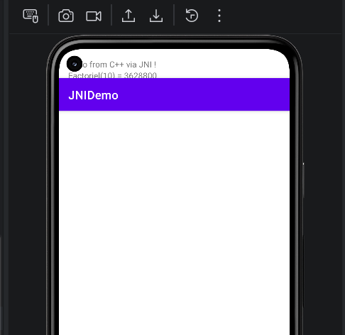
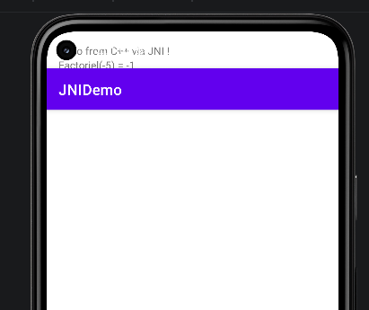
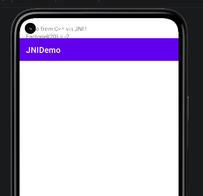
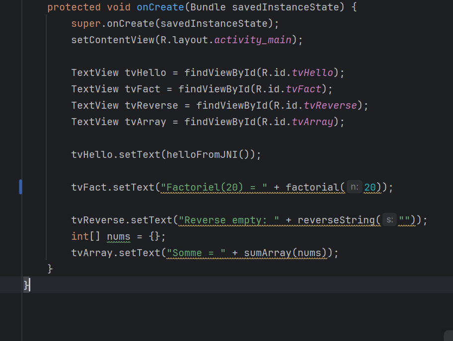

# 📱 JNIDemo — Android JNI Integration Lab

## 📌 Overview

**JNIDemo** is an Android application that demonstrates how to integrate **native C++ code** into a Java-based Android app using the **Java Native Interface (JNI)**.

The project highlights how Android applications can delegate specific tasks to native code for **performance**, **security**, and **low-level processing**.

---

## 🎯 Objectives

This project was developed to achieve the following goals:

* Understand how JNI connects Java and C++
* Configure Android NDK and CMake
* Call native methods from Java
* Pass data between Java and C++ (String, int, arrays)
* Handle errors in native code
* Debug native execution using Logcat

---

## 🛠️ Technologies Used

* **Java** (Android development)
* **C++** (native logic)
* **JNI (Java Native Interface)**
* **Android NDK**
* **CMake**
* **Android Studio**

---

## 🏗️ Project Architecture

Java Layer (MainActivity)
⬇
JNI Bridge
⬇
Native C++ (libnative-lib.so)
⬇
Result returned to Java UI

---

## 🚀 Features

### 🔹 1. Hello from JNI

Calls a native function that returns a string from C++:

```
Hello from C++ via JNI !
```

---

### 🔹 2. Factorial (Native Computation)

Calculates factorial in C++ with error handling:

| Input | Output             |
| ----- | ------------------ |
| 10    | 3628800            |
| -5    | -1 (invalid input) |
| 20    | -2 (overflow)      |

---

### 🔹 3. Reverse String

Sends a string from Java → C++ → returns reversed string.

**Example:**

```
Input:  "JNI Demo"
Output: "omeD INJ"
```

---

### 🔹 4. Sum of Array

Processes an `int[]` array in native code.

**Example:**

```
Input:  [1, 2, 3, 4, 5]
Output: 15
```

---

## ✅ Conclusion

This project successfully demonstrates how to integrate native C++ code into an Android application using JNI.

It provides a solid foundation for advanced topics such as:

* Native security mechanisms
* Reverse engineering resistance
* Image processing (OpenCV)
* Cryptography and performance optimization

---

## 👨‍💻 Author

Student Project — Android Security / JNI Lab




